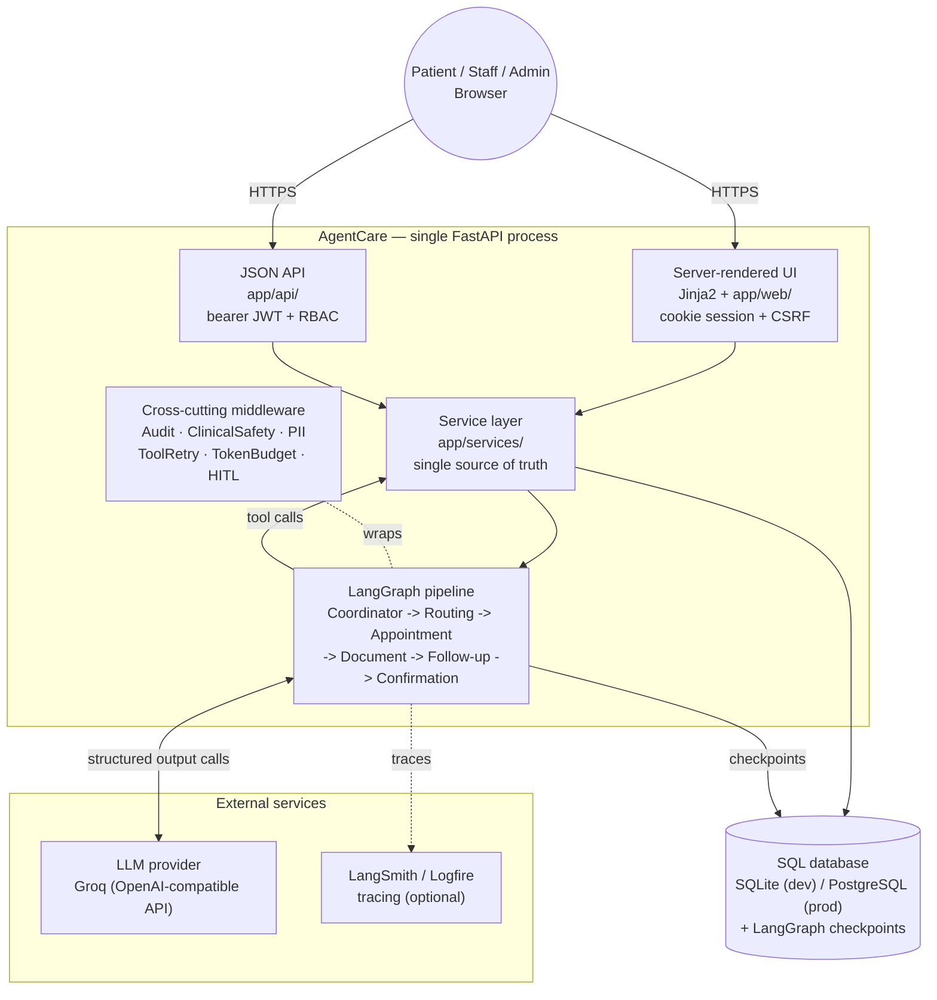

# AgentCare

**Agentic AI for patient administration and care coordination — a FastAPI + LangGraph system that turns a free-text patient request into completed, auditable administrative work.**

> Submitted as part of an application to **Dafinitiq AI — AI Engineer Associate**.
> Author: **Abdullah** ([abdullahizaq321@gmail.com](mailto:abdullahizaq321@gmail.com))
> Live demo: **[gentcare-ai-patient-coordination.onrender.com](https://gentcare-ai-patient-coordination.onrender.com)**
> (free tier — the first request after a period of inactivity may take ~30-50s to wake up)

---

## Table of contents

- [The problem](#the-problem)
- [Key features](#key-features)
- [Tech stack](#tech-stack)
- [Architecture overview](#architecture-overview)
- [Setup — local](#setup--local)
- [Setup — Docker](#setup--docker)
- [Environment variables](#environment-variables)
- [Usage](#usage)
- [Folder structure](#folder-structure)
- [Testing](#testing)
- [Future improvements](#future-improvements)
- [Deep dive](#deep-dive) — the six agents, middleware, safety boundary, HITL, observability, cost strategy
- [Attribution](#attribution)

---

## The problem

Hospital front-desk administration — booking the right appointment, filing the right
document, scheduling a reminder — is repetitive, error-prone when done manually at
volume, and risky to hand to an LLM without hard guardrails, because a chatbot that
casually answers "what medicine should I take for a headache" is a liability, not a
convenience.

AgentCare turns a free-text patient request — *"I need a cardiology appointment next
week, and I want to attach my previous ECG"* — into completed administrative work: the
right department, a real booked slot, filed and de-duplicated documents, a scheduled
reminder, and a confirmation read back from the database, not invented by the model.

It handles **administration only**. It never diagnoses, prescribes, advises on
dosage, or claims to replace a clinician — and that boundary is enforced in code
(a six-layer safety pipeline, see [Deep dive](#deep-dive)), not merely requested in a
system prompt.

```
Patient request (free text, optional attachments)
        │
        ▼
  Safety gate ──────────► escalate → suspend → human review
        │
        ▼
  Coordinator      understands the request, records the plan
        ▼
  Routing          maps it to exactly one department
        ▼
  Appointment      finds real slots, books / reschedules / cancels
        ▼
  Document         classifies, files, de-duplicates, finds gaps
        ▼
  Follow-up        schedules reminders and follow-up tasks
        ▼
  Confirmation     assembled from persisted rows, never from agent prose
```

Every step writes to a persistent SQL database and an append-only audit trail.

---

## Key features

- **Six specialized LangGraph agents** (Coordinator, Routing, Appointment, Document, Follow-up, Safety), each with its own prompt, tools, and structured-output contract — not one agent improvising everything.
- **Six-layer clinical safety boundary**: identical administrative-only prompt clauses, a deterministic regex scanner that runs before any LLM call, semantic LLM judgement, output scanning, tool-argument inspection, and an optional NeMo Guardrails semantic rail.
- **Human-in-the-loop that survives a restart** — safety escalations and sensitive-action approvals are real LangGraph interrupts backed by a durable checkpointer, with idempotent resume (approving never re-runs the agent that already ran).
- **Real booking, not a mock** — atomic slot-claiming (`UPDATE ... WHERE status = 'open'`) prevents double-booking under concurrent requests; confirmations are assembled from the database, never from model text.
- **Document intelligence** — upload classification by filename heuristics, SHA-256 duplicate detection, missing-document gap checks against department requirements, and on-demand AI summaries that are themselves safety-scanned before being shown to anyone.
- **Full audit trail** — every tool call, every access denial, every human decision is written to an append-only `audit_events` table; nothing an agent does is invisible to a compliance reviewer.
- **Staff dashboard** — pending escalations queue, per-run workflow drill-down with lineage (what the pipeline actually checked), doctor assignment, and hospital directory management (departments, doctors, slots).
- **Server-rendered UI, zero frontend build** — the same FastAPI process serves a Jinja2 + vanilla CSS/JS interface and a JSON API side by side, calling one shared service layer.
- **Cost-aware by design** — deterministic fast paths before any model call, structured output everywhere, per-agent model tiering, and a hard token budget that escalates to a human instead of running away.

---

## Tech stack

| Layer | Technology |
|---|---|
| Language | Python 3.11–3.13 |
| Web framework | FastAPI, Starlette, Uvicorn |
| Agent framework | LangChain v1 (`create_agent`), LangGraph v1 (`StateGraph`, interrupts, checkpoints) |
| LLM provider | Groq (`openai/gpt-oss-120b`), via any OpenAI-compatible endpoint |
| Guardrails | NVIDIA NeMo Guardrails (optional semantic rail) |
| Database / ORM | SQLAlchemy 2.x + Alembic migrations — SQLite (dev) / PostgreSQL (prod) |
| Auth | PyJWT + bcrypt (cookie session for the UI, bearer token for the API) |
| Interface | Jinja2 templates, plain CSS, vanilla JS — no build step, no frontend framework |
| Observability | LangSmith, Pydantic Logfire (both optional) |
| Testing | pytest (298 tests), ruff (lint) |
| Packaging | Docker, `uv` (dependency + lock management) |

---

## Architecture overview

AgentCare is **one FastAPI application**, not a set of microservices: a server-rendered
UI and a JSON API both sit on top of the same service layer, which is the only thing
that talks to the database and the only thing the LangGraph agents' tools call into.



A full write-up — request-by-request data flow, why there's one service layer behind
two callers, and the data model — lives in **[`docs/architecture.md`](docs/architecture.md)**.

---

## Setup — local

**Requirements:** Python 3.11–3.13 and [uv](https://docs.astral.sh/uv/) (or plain `pip`
if you don't have `uv`). No Node.js — the interface is server-rendered by FastAPI
itself.

```bash
git clone <this-repo-url>
cd Dafintiq
uv sync
```

No `uv`? Use plain pip instead:

```bash
python -m venv .venv
.venv\Scripts\activate          # Windows
# source .venv/bin/activate     # macOS/Linux
pip install -r requirements.txt
```

Configure your environment:

```bash
cp .env.example .env
```

Edit `.env` and set at minimum:

```bash
LLM_API_KEY=your-llm-provider-key
JWT_SECRET=some-long-random-string
```

Initialise and seed the database:

```bash
uv run alembic upgrade head
uv run python -m seed.seed_data
```

Start the app:

```bash
uv run uvicorn app.main:app --reload
```

Open **http://localhost:8000**. See [Usage](#usage) for demo logins.

---

## Setup — Docker

A single image, no local Python toolchain needed.

```bash
cp .env.example .env     # edit .env: set LLM_API_KEY and JWT_SECRET
docker compose up --build
```

This builds and runs the backend, serving both the JSON API and the UI on
**http://localhost:8000**. Migrations and synthetic demo-data seeding both run
automatically on every container start (`docker-entrypoint.sh`) — seeding is a no-op
once data already exists, so this is safe to leave in on every restart.

---

## Environment variables

| Variable | Default | Notes |
|---|---|---|
| `LLM_API_KEY` | — | **Required.** API key for the LLM provider |
| `LLM_BASE_URL` | `https://api.groq.com/openai/v1` | Any OpenAI-compatible endpoint |
| `LLM_MODEL` | `openai/gpt-oss-120b` | Default model for all agents |
| `LLM_MODEL__ROUTING` / `__DOCUMENT` / `__SAFETY` | — | Optional per-agent model override, e.g. route a cheaper model to a high-volume classifier |
| `LLM_MAX_TOKENS` | `1024` | Max output tokens per model call |
| `LLM_MAX_TOKENS__ROUTING` / `__DOCUMENT` / `__SAFETY` | — | Per-agent override (0/unset inherits the default) |
| `WORKFLOW_TOKEN_BUDGET` | `120000` | Total tokens one request may consume across all agents before escalating to a human |
| `AGENT_RUN_CALL_LIMIT` | `8` | Model calls a single agent may make before being stopped |
| `WORKFLOW_THREAD_CALL_LIMIT` | `40` | Model calls one workflow may make in total |
| `SUMMARIZATION_TRIGGER_TOKENS` | `6000` | Conversation tokens after which an agent summarizes instead of resending history |
| `NEMOGUARDRAILS_ENABLED` | `false` | Adds the semantic NeMo Guardrails input/output rail — needs `LLM_API_KEY` |
| `MAX_DOCUMENT_SIZE_MB` | `10` | Cap on one uploaded report/document |
| `DATABASE_URL` | `sqlite:///./agentcare.db` | Swap for `postgresql+psycopg://…` in production |
| `JWT_SECRET` | — | **Required. Change this** for any non-local deployment |
| `JWT_ALGORITHM` | `HS256` | JWT signing algorithm |
| `JWT_EXPIRE_MINUTES` | `120` | Session / token lifetime |
| `LANGSMITH_TRACING` | `false` | Set `true` to enable native LangSmith tracing |
| `LANGSMITH_API_KEY` | — | Required if `LANGSMITH_TRACING=true` |
| `LANGSMITH_PROJECT` | `agentcare-dev` | Project name traces are grouped under |
| `LANGSMITH_ENDPOINT` | `https://api.smith.langchain.com` | Only change for a self-hosted/regional instance |
| `LOGFIRE_ENABLED` | `false` | Enable Pydantic Logfire tracing |
| `LOGFIRE_TOKEN` | — | Required if `LOGFIRE_ENABLED=true` |
| `LOGFIRE_CONSOLE` | `false` | Print spans to the console instead of the cloud |
| `CORS_ORIGINS` | `http://localhost:8000` | Comma-separated origins allowed to call the JSON API cross-origin |
| `ENV` | `development` | Free-text deployment tag |
| `API_BASE_URL` | `http://localhost:8000` | This app's own base URL |
| `LOG_LEVEL` | `INFO` | Python logging level |

`.env` is gitignored — no real credentials or patient data are committed to this
repository; all sample data is synthetic. See [`.env.example`](.env.example) for the
full annotated file.

---

## Usage

Demo logins (seeded, password `AgentCare!2026` for all):

| Role | Email | What you can do |
|---|---|---|
| Patient | `asha.menon@example.com` | Submit requests, browse doctors, book/cancel appointments, upload documents, check reminders |
| Staff | `staff@agentcare.local` | Review pending escalations, drill into workflow runs, manage the directory |
| Admin | `admin@agentcare.local` | Everything staff can, plus creating new staff/admin accounts |

The JSON API is also browsable at **http://localhost:8000/docs** (Swagger).

> **Screenshots:** the interface was rebuilt as a server-rendered dark-theme UI after
> the project's original screenshots were taken — run the app locally to see the
> current UI. (A fresh set of screenshots is a planned follow-up — see
> [Future improvements](#future-improvements).)

---

## Folder structure

```
app/
├── main.py                  FastAPI application factory
├── api/                     JSON API routers + RBAC dependencies (bearer JWT)
├── web/                     Server-rendered UI routers (cookie session + CSRF)
├── core/                    config · security · logging · observability
├── db/models/               SQLAlchemy 2.x models
├── schemas/                 Pydantic DTOs and agent output contracts
├── services/                Business logic — the single source of truth
├── agents/                  The six agents, LangGraph assembly, middleware, tools, prompts
└── guardrails/              NeMo Guardrails config (optional layer 6)

templates/                   Jinja2 templates — base layout, per-page templates, macros/
static/                      Plain CSS + vanilla JS (no build step, no framework)

alembic/                     Database migrations
seed/                        Synthetic sample data loader
tests/                       298 pytest tests
evals/                       Safety red-team + routing-accuracy evals (release gates)
docs/                        architecture.md + the original design blueprint
Dockerfile · docker-compose.yml · docker-entrypoint.sh    Container packaging
```

---

## Testing

```bash
uv run pytest              # 298 tests: service layer, API + UI routes, RBAC,
                            # LangGraph interrupt/resume (scripted agents, no LLM key needed)
uv run ruff check .        # lint
```

The eval scripts double as standalone release gates:

```bash
uv run python -m evals.safety_redteam
uv run python -m evals.routing_accuracy
```

The suite covers the service layer against a real database (including the booking
race condition), the safety scanner against benign and adversarial phrasings, graph
topology and conditional routing, and full end-to-end workflow runs using scripted
agents — so the pipeline, tools, state handoff, interrupts, and database writes are
all exercised without needing a live LLM key.

---

## Future improvements

- **Fresh screenshots / a short demo video** of the current server-rendered UI.
- **Postgres in production** — the `DATABASE_URL` swap is already supported; a real deployment just needs the connection string.
- **Refresh tokens** — sessions currently expire outright at `JWT_EXPIRE_MINUTES`; a refresh-token flow would avoid re-login on long staff shifts.
- **Rate limiting beyond login** — only the login endpoint is currently rate-limited; the same protection could extend to document upload and request submission.
- **Multi-tenancy** — the data model assumes a single hospital; department/doctor scoping by tenant would be the natural next step for a multi-site deployment.
- **Async LLM calls** — agent nodes call the LLM synchronously today; moving to async would let independent branches (e.g. document classification alongside appointment search) run concurrently.
- **A real notification channel** — `reminder_service.dispatch_notification` currently logs a `Notification` row instead of sending an actual email/SMS; wiring a provider (SES, Twilio) is a contained change behind that one function.

---

## Deep dive

The sections below cover the agent design, middleware stack, safety boundary, and
operational details in full. Skip ahead if you've seen enough — this is here for
anyone evaluating the engineering depth rather than just running the app.

### The six agents

Each has its own prompt module, its own tools, and its own responsibility. None is a
renamed helper function.

| Agent | Responsibility | Tools | Structured output |
|---|---|---|---|
| **Coordinator** | Understands the administrative intent, records the plan, tracks the run | `get_patient_record`, `load_workflow_state`, `save_workflow_state` | `AdminIntent` |
| **Routing** | Maps the request to exactly one department; escalates rather than guessing | `lookup_departments`, `suggest_department_by_keywords`, `flag_uncertain_routing` | `RoutingDecision` |
| **Appointment** | Finds real slots, checks conflicts, books / reschedules / cancels | `find_available_slots`, `book_appointment`, `list_my_appointments`, `reschedule_appointment`, `cancel_appointment` | `AppointmentOutcome` |
| **Document** | Classifies uploads, files them, detects duplicates, finds missing documents | `list_pending_documents`, `suggest_document_type`, `classify_and_store_document`, `check_missing_documents` | `DocumentClassification` |
| **Follow-up** | Schedules reminders and follow-up tasks; assembles the confirmation | `list_my_reminders`, `create_appointment_reminder`, `schedule_followup_task`, `send_notification`, `get_appointment_summary` | `FollowUpPlan` |
| **Safety** | Judges flagged content and creates escalation records | `scan_for_unsafe_content`, `check_existing_escalations`, `create_escalation` | `SafetyVerdict` |

**23 tools total**, all performing real logic against the database. Tools read
`patient_id` from the authenticated request context — never from anything the model
produced — so an agent cannot act on a patient it wasn't given, because it is never
given the ability to name one.

### Middleware: safety, audit, PII, retries

Every agent is wrapped in the same stack
([`app/agents/middleware/stack.py`](app/agents/middleware/stack.py)):

| Middleware | Purpose |
|---|---|
| `AuditMiddleware` *(custom)* | Writes an `AuditEvent` for **every** tool call |
| `ClinicalSafetyMiddleware` *(custom)* | Deterministic safety scanning on input, output, and tool arguments |
| `NemoGuardrailsMiddleware` *(custom)* | NeMo Guardrails semantic input/output check — layer 6 of the safety boundary; off by default |
| `PIIMiddleware` × 3 | Redacts email, masks phone numbers, hashes MRNs in outgoing text |
| `ToolRetryMiddleware` | Exponential backoff with jitter for transient failures |
| `ModelCallLimitMiddleware` | Hard ceiling on model calls per run and per thread |
| `TokenBudgetMiddleware` *(custom)* | Hard ceiling on total tokens per workflow run — escalates to a human rather than continuing to spend |
| `ContextEditingMiddleware` | Trims tool results so a long run's context stops growing |
| `HumanInTheLoopMiddleware` | Staff approval gates on sensitive tools |
| `TodoListMiddleware` | Coordinator only — planning for multi-part requests |

`AuditMiddleware` is the outermost wrapper, so it observes tool calls that inner
middleware subsequently *blocks* — blocked attempts are exactly what a compliance
reviewer needs to see. There is no code path by which an agent invokes a tool without
an audit record being written.

### Human-in-the-loop

Two mechanisms suspend a run, and both are genuine LangGraph interrupts backed by a
durable checkpointer — not an `if` statement that skips a step:

1. **Safety escalation** — for emergency or medical-advice content, where the problem is the request itself.
2. **`HumanInTheLoopMiddleware`** — declarative per-tool approval on sensitive actions (cancel, reschedule).

Because the pause lives in the checkpoint, a killed process loses nothing — verified
in the test suite by resuming a suspended run from a **freshly constructed graph
object**, which is what a server restart looks like. LangGraph replays an interrupted
node from its start on resume; the safety gate checks for a prior human decision
before doing anything, so approving a run never re-escalates it or re-invokes the
safety agent.

### The clinical safety boundary

The rule whose violation invalidates the whole system — enforced in six independent
layers:

| Layer | Mechanism |
|---|---|
| 1 | An identical "administrative-only" clause in all six system prompts, worded verbatim |
| 2 | Deterministic pattern scan on the inbound request, before any tokens are spent |
| 3 | The Safety agent's semantic judgement on anything the scan flags |
| 4 | Output scan on what agents produce, ending the run on violation |
| 5 | Tool-argument inspection, since unsafe text can arrive from an uploaded document |
| 6 | [NVIDIA NeMo Guardrails](https://github.com/NVIDIA-NeMo/Guardrails) semantic self-check, catching paraphrased jailbreaks layer 2's regex can miss |

Layer 2 matters most and is pure Python
([`app/services/safety_service.py`](app/services/safety_service.py)) — a regex cannot
be argued out of firing by a persuasive request. The scanner is tuned to over-trigger
rather than under-trigger: a false positive costs a staff member ten seconds, a false
negative means the system gave medical advice. Every trigger creates a persisted
`Escalation` and pauses for a human; the patient always receives a clear "a person
will review this," never a silent drop.

### Document summaries

An on-demand, administrative-only summary of an uploaded report, triggered by a
"Summarize" button — not generated automatically at upload, since not every upload
needs one and every summary costs a model call. Text extraction is best-effort
(`.pdf` via `pypdf`, `.txt` directly, anything else gets an honest "not available"
message). The prompt is explicitly non-clinical — type, date, facility, a factual
description of contents — never an interpretation. The output is safety-scanned
before it's ever persisted or returned, since this call sits outside the agent graph
and bypasses the usual middleware.

### Observability

Every agent, middleware hook, and tool call is traced with a real
`thread_id = workflow_run_id`. Two backends are wired up
([`app/core/observability.py`](app/core/observability.py)), both optional and both
degrading gracefully with no credentials configured: **LangSmith** (native tracing)
and **Pydantic Logfire** (also instruments the HTTP client and, with an extra, host
CPU/memory).

### Cost and token strategy

1. **Deterministic-first.** Department routing hits a keyword table, document classification hits a filename table. The model is invoked only where natural-language judgement is genuinely required.
2. **The safety gate costs nothing on the common path.** The deterministic scan runs first; the Safety agent is invoked only when it trips.
3. **Structured output everywhere.** One call returns exactly the needed fields — no free-text parsing, no reformat-retry tax.
4. **State-sliced context.** Each agent receives a focused instruction, not an accumulating transcript, so per-node token cost stays flat however long a workflow becomes.
5. **Hard ceilings.** `ModelCallLimitMiddleware` and `TokenBudgetMiddleware` cap calls and spend per run, making a looping agent a bounded incident rather than an unbounded bill.
6. **Idempotent resume.** Approving an escalation does not re-run the agent that already ran.

### Concurrency

Slot claiming uses a single conditional `UPDATE ... WHERE id = ? AND status = 'open'`
and checks the affected row count — atomic on both SQLite and PostgreSQL, unlike
`SELECT ... FOR UPDATE`, which SQLite silently ignores.

---

## Attribution

Third-party components: [LangChain v1](https://docs.langchain.com/oss/python/langchain/overview)
and [LangGraph](https://docs.langchain.com/oss/python/langgraph/overview) provide the
agent harness and graph orchestration. [NVIDIA NeMo Guardrails](https://github.com/NVIDIA-NeMo/Guardrails)
provides the optional layer-6 semantic self-check rails. [`pypdf`](https://pypi.org/project/pypdf/)
does PDF text extraction for document summaries. FastAPI, SQLAlchemy, Alembic, and
Pydantic are used as documented above; the interface is server-rendered with Jinja2
and plain CSS/JS — no frontend framework.

All architecture decisions, safety design, and code were reviewed and verified
against a running system.

---

**AgentCare handles hospital administration. It is not a medical device, and it does
not provide medical advice.**
