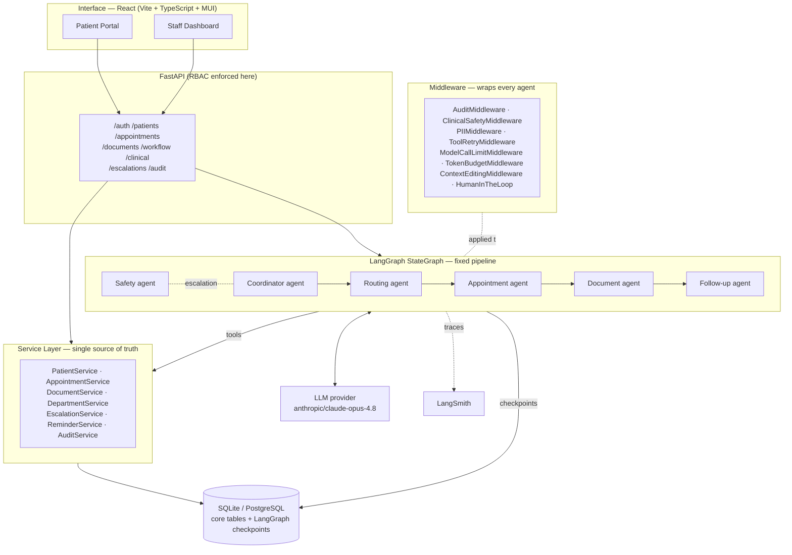
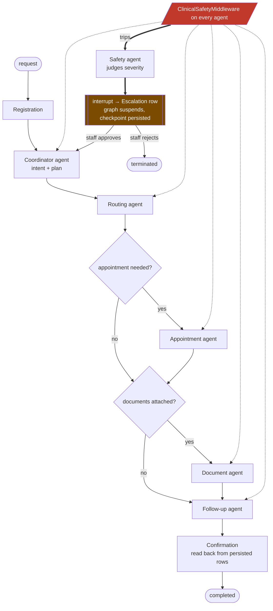

# AgentCare — Architecture Blueprint

**AgentCare Build Challenge 2026 · Agentic AI for Patient Administration & Care Coordination**
Design document · **v2.0 — revised for LangChain v1 + LangGraph v1, uv-managed**

> This document is the technical blueprint for AgentCare. **v2.0 supersedes v1.0**: the stack moved from LangChain 0.3.x to the **LangChain v1 `create_agent` + middleware** architecture, and from pip/`requirements.txt` to **uv**. The revision is not cosmetic — LangChain v1's middleware system turns three of this hackathon's scored requirements (human oversight, PII handling, retry/recovery) from hand-rolled plumbing into first-class, declarative framework primitives.

---

## 1. Design thesis

The rubric rewards one thing above all: **genuine end-to-end wiring** — route → service → agent → tool → database → persisted result — with a real safety boundary and real human oversight. It penalizes two failure modes equally: (a) a CRUD app wearing an agent costume, and (b) a "creative" multi-agent swarm too unpredictable to trust with healthcare administration.

AgentCare resolves that tension with a **deterministic skeleton, agentic interior, cross-cutting guardrails** design:

- The *pipeline* (registration → intent → routing → appointment → documents → confirmation → follow-up) is a fixed **LangGraph `StateGraph`** — not something an LLM improvises. Every run takes the same shape, which is what makes it auditable and testable.
- *Inside* each stage sits a genuine **`create_agent()` agent** (LangChain v1) — a real ReAct-style tool-calling loop with its own system prompt, its own tools, and its own middleware stack. These are not prompt-wrapped functions; each one plans and calls tools until its sub-goal is met.
- **Safety, audit, PII, retry, and cost limits are middleware**, not code sprinkled through the nodes. They wrap *every* agent uniformly. This is the single biggest architectural win of the v1 revision: a cross-cutting concern implemented once, provably applied everywhere, and impossible for an individual agent to forget.

---

## 2. Confirmed stack (all versions verified installed, 2026-07-26)

| Layer | Choice | Version |
|---|---|---|
| Package/env manager | **uv** | 0.11.14 |
| Python | CPython | 3.13 |
| Agent framework | **LangChain v1** (`create_agent`, middleware) | 1.3.14 |
| Orchestration | **LangGraph v1** (`StateGraph`, `interrupt`, `Command`) | 1.2.9 |
| Core abstractions | `langchain-core` | 1.5.1 |
| LLM client | `langchain-openai` → **configurable OpenAI-compatible provider** | 1.4.1 |
| Model | `anthropic/claude-opus-4.8` via the configured provider | — |
| Checkpointer | `langgraph-checkpoint-sqlite` (Postgres variant for prod) | 3.1.0 |
| Backend | FastAPI | 0.140.0 |
| Frontend | React (Vite + TypeScript + MUI) | Vite 5, React 18, MUI 5 |
| Database | SQLAlchemy 2.x + Alembic → SQLite (dev) / PostgreSQL (prod) | 2.0.51 |
| Observability | LangSmith | 0.10.10 |
| Auth | **PyJWT** + passlib/bcrypt | 2.10+ |

**Two dependency-management notes:**
- `uv sync` + a committed `uv.lock` gives judges byte-identical, reproducible installs — a meaningful credibility signal versus an unpinned `requirements.txt`. A generated `requirements.txt` is *also* exported (`uv export`) purely so the hackathon's automated LLM-client check has the file shape it looks for.
- **PyJWT replaces python-jose** from the v1.0 plan. python-jose is effectively unmaintained and carries known CVEs; shipping it in a healthcare-themed submission would be a self-inflicted wound in a category the rubric explicitly scores.

---

## 3. Why LangChain v1 changes the design (the core revision)

In the v1.0 blueprint, safety wrapping, audit logging, retries, and HITL were each hand-written orchestration code I would have to remember to apply at every node. In LangChain v1 they are **middleware attached declaratively to every agent**. Verified hook surface on `AgentMiddleware`:

`before_agent` · `before_model` · `wrap_model_call` · `wrap_tool_call` · `after_model` · `after_agent` (each with an `a*` async twin)

This maps onto the scoring rubric almost line for line:

| Rubric requirement | v1.0 plan (hand-rolled) | **v2.0 (LangChain v1 middleware)** |
|---|---|---|
| Human escalation / approval | Manual `interrupt()` calls per node | **`HumanInTheLoopMiddleware`** `interrupt_on={tool: {allowed_decisions:[approve,edit,reject]}}` — declarative per-tool approval gates |
| PII handling | Ad-hoc redaction helper | **`PIIMiddleware`** with `strategy=block\|redact\|mask\|hash`, custom detectors for healthcare identifiers |
| Error handling & retry | `tenacity` decorators on tools | **`ToolRetryMiddleware`** (exponential backoff + jitter) |
| Token / cost control | "be careful" | **`ModelCallLimitMiddleware`** (hard per-run + per-thread caps), **`TokenBudgetMiddleware`** (custom, per-workflow token ceiling), **`ContextEditingMiddleware`** |
| Context management | Manual state slicing | Above two middlewares + explicit state slicing |
| Coordinator planning | Custom todo structure | **`TodoListMiddleware`** — real, inspectable plan state |
| Safety boundary | Wrapper functions | **Custom `ClinicalSafetyMiddleware`** — `before_model` + `after_model` + `wrap_tool_call` |
| Audit logging | `audit()` call at each site | **Custom `AuditMiddleware`** — `wrap_tool_call` captures *every* tool invocation automatically |

The last two rows matter most. `AuditMiddleware` means **no tool call can execute unaudited** — the audit trail is structurally guaranteed rather than dependent on a developer remembering a line. Same for safety: `ClinicalSafetyMiddleware` sits on every agent, so there is no agent that can be reached by an unscanned path.

---

## 4. The agent roster (six genuinely distinct agents)

Each agent is a separate `create_agent()` instance with **its own system prompt module, its own tool set, and its own bounded responsibility** — none share a prompt, none is a renamed helper.

| Agent | Own responsibility | Tools it owns | Structured output (`response_format`) | Notable extra middleware |
|---|---|---|---|---|
| **Coordinator** | Parses free-text into a structured intent, decides which downstream stages apply, tracks completion, assembles the final confirmation | `get_patient_record`, `load_workflow_state`, `save_workflow_state` | `AdminIntent` | `TodoListMiddleware` (multi-part requests) |
| **Department Routing** | Maps intent → department; deterministic keyword table first, LLM only on ambiguity; forbidden from naming a diagnosis | `lookup_departments`, `suggest_department_by_keywords`, `flag_uncertain_routing` | `RoutingDecision{department_name, confidence, rationale, is_administrative_request}` | — |
| **Appointment** | Finds real slots, checks doctor/patient conflicts, books/reschedules/cancels transactionally | `find_available_slots`, `book_appointment`, `list_my_appointments`, `reschedule_appointment`, `cancel_appointment` | `AppointmentOutcome` | **`HumanInTheLoopMiddleware`** on reschedule/cancel |
| **Document** | Classifies uploads, computes checksums, detects duplicates, checks required-document gaps | `list_pending_documents`, `suggest_document_type`, `classify_and_store_document`, `check_missing_documents` | `DocumentClassification` | `PIIMiddleware` (tool results) |
| **Follow-up** | Administrative reminder timing and follow-up cadence — never clinical follow-up instructions | `list_my_reminders`, `create_appointment_reminder`, `schedule_followup_task`, `send_notification`, `get_appointment_summary` | `FollowUpPlan` | — |
| **Safety & Escalation** | Deterministic + LLM screening of every request and response; blocks diagnostic/prescriptive/dosage content; creates escalation records; owns `interrupt()` | `scan_for_unsafe_content`, `check_existing_escalations`, `create_escalation` | `SafetyVerdict{is_emergency, is_medical_advice_request, is_sensitive, confidence}` | — (it *is* the guardrail) |

**Why the Safety agent exists as an agent *and* as middleware:** the middleware (`ClinicalSafetyMiddleware`) is the cheap, always-on, deterministic gate that runs on every model call and tool call. The Safety *agent* is the escalation-reasoning specialist the middleware delegates to when the fast gate trips and a judgment call is needed (is this an emergency, or just someone describing history?). Fast path stays free; expensive reasoning happens only on suspicion.

---

## 5. Middleware stack (applied to every agent)

```python
# app/agents/middleware/stack.py  (as built)
def standard_middleware(agent_name: str, *, sensitive_tools: dict | None = None,
                         scan_output: bool = True, run_limit: int | None = None):
    stack = [
        AuditMiddleware(agent_name),            # custom  — wrap_tool_call → AuditEvent
        ClinicalSafetyMiddleware(agent_name, scan_output=scan_output),  # custom
        PIIMiddleware("email",  strategy="redact", apply_to_output=True),
        PIIMiddleware("phone",  strategy="mask",   detector=PHONE_PATTERN, apply_to_output=True),
        PIIMiddleware("mrn",    strategy="hash",   detector=MRN_PATTERN,   apply_to_output=True),
        ToolRetryMiddleware(max_retries=2, backoff_factor=2.0, initial_delay=0.5,
                             max_delay=8.0, jitter=True, on_failure="continue"),
        ModelCallLimitMiddleware(run_limit=run_limit or settings.agent_run_call_limit,
                                  thread_limit=settings.workflow_thread_call_limit,
                                  exit_behavior="end"),
        TokenBudgetMiddleware(agent_name, budget=settings.workflow_token_budget),  # custom
        ContextEditingMiddleware(),
    ]
    if sensitive_tools:
        stack.append(HumanInTheLoopMiddleware(interrupt_on=sensitive_tools,
             description_prefix="AgentCare requires staff approval"))
    return stack
```

Execution order is defined by the framework: `before_*` hooks run first-to-last, `after_*` run **in reverse**, and `wrap_*` hooks nest (the first listed wraps all others). `AuditMiddleware` is listed first deliberately — as the outermost wrapper it observes every tool call including ones that safety later blocks, so **blocked attempts are themselves audited**, which is exactly what a compliance reviewer would want to see.

> `PIIMiddleware` takes **one PII type per instance** (verified signature), with built-in types `email`/`credit_card`/`ip`/`mac_address`/`url` plus custom regex or callable `detector`s — hence the stacked instances above for healthcare-specific identifiers.

---

## 6. System architecture



**Why services sit between agents and the API:** agent tools are thin wrappers over the *same* service methods the REST routes call. A booking made by a staff member and one made by the Appointment agent traverse identical validation, conflict-checking, and audit logic — exactly one code path for "book an appointment." That is what stops the demo path from being a parallel reality.

---

## 7. Workflow graph & HITL



Two complementary HITL mechanisms, deliberately:

1. **`HumanInTheLoopMiddleware`** — declarative, per-tool approval on sensitive actions (cancel, reschedule). Staff choose `approve` / `edit` / `reject`; resumed via `Command(resume={"decisions":[{"type":"approve"}]})`.
2. **Custom `interrupt()`** from the safety path — for emergency/medical-advice content, where the issue is the *request*, not a specific tool call.

Both suspend the graph into the checkpointer, so a killed process loses nothing: the pending decision sits in the checkpoint table until staff act, and `Command(resume=...)` continues from the exact suspension point.

**Dual persistence, on purpose:** the LangGraph checkpointer gives resumability; the app-level `WorkflowRun` / `AuditEvent` tables give a human-readable trail the Staff Dashboard queries directly, without decoding LangGraph's internal checkpoint blob.

---

## 8. Cost & token strategy

Opus-class tokens are expensive, so control is architectural, not aspirational:

1. **Deterministic-first, LLM-fallback** — routing hits a keyword/specialty table before any LLM call; the model is invoked only on genuine ambiguity. Avoids the majority of routing calls on typical phrasing.
2. **`response_format=` structured output** — one call returns exactly the needed fields; no free-text parsing, no reformat-retry tax.
3. **`ModelCallLimitMiddleware(run_limit=8)`** — a hard ceiling per run. A looping agent is now a *bounded* incident, not an unbounded bill.
4. **`SummarizationMiddleware` + `ContextEditingMiddleware`** — bound context growth on long workflows instead of resending full history.
5. **State-sliced context** — each agent receives only the state fields it needs (the Document agent never sees the appointment negotiation).
6. **Per-agent model tiering** — `settings.model_for(agent_name)` reads `LLM_MODEL__<AGENT>` with fallback to the default. Everything defaults to Opus per your instruction; a cost-sensitive deploy drops Routing/Document to a lighter model via env var alone.
7. **Token usage persisted, not just spent** — `usage_metadata` from each response is written into `AuditEvent.event_metadata`, so the Staff Dashboard shows a real running cost. "Optimum token use" becomes evidence rather than a claim.

---

## 9. Safety boundary — defense in depth

This is the rule that zeroes the whole submission, so it gets five independent layers:

| Layer | Mechanism | Catches |
|---|---|---|
| 1 | Identical "administrative-only, never diagnose/prescribe/dose" clause in every agent's system prompt | Baseline behavior |
| 2 | **Deterministic pre-filter** in `ClinicalSafetyMiddleware.before_model` — drug names, dosage patterns, diagnostic verbs | Cheap, model-independent, **cannot be prompt-injected away** |
| 3 | **LLM verdict** from the Safety agent (`SafetyVerdict` structured output) | Semantic cases regex misses |
| 4 | **`after_model` output scan** with `jump_to="end"` on violation | An agent generating diagnostic-sounding text |
| 5 | **`wrap_tool_call` argument inspection** | Unsafe content reaching a tool even if earlier layers passed |

Every trigger creates a persisted `Escalation` and pauses for a human — the patient always gets "a person will review this," never a silent drop. Human supervision is an auditable record, not a README sentence.

---

## 10. Data model

Unchanged from v1.0 and already implemented: `User`, `PatientProfile`, `Department` (with `routing_keywords`, `required_document_types`), `Doctor`, `AppointmentSlot`, `Appointment`, `PatientDocument` (checksum, duplicate link, classification confidence), `WorkflowRun` (`state_snapshot`), `Reminder`, `Notification`, `Escalation`, `AuditEvent`. See [app/db/models/](../app/db/models/).

---

## 11. RBAC, observability, evals, error handling

- **RBAC** — PyJWT tokens carry `sub` + `role`; a `require_role(*roles)` FastAPI dependency guards every route, and patient-scoped queries filter by the authenticated patient id at the SQL level (guessing an ID gets you nothing). Every rejection writes an `AuditEvent(action="access_denied")`.
- **Observability** — LangSmith traces every agent, middleware hook, tool call, and token count per `thread_id = workflow_run_id`; degrades gracefully when `LANGSMITH_API_KEY` is absent (required — the hackathon CI runs with zero keys). `structlog` binds `workflow_run_id` to every log line.
- **Evals** — three datasets: *routing accuracy*; a *safety red-team set* (diagnosis/dosage/prescription asked directly and obliquely) treated as a **release gate**, not a metric; and *end-to-end golden workflows* asserting on final persisted DB state, not agent prose.
- **Error handling** — `ToolRetryMiddleware` (backoff + jitter), then escalation on repeated tool failure. Slot booking claims a slot with a single conditional `UPDATE ... WHERE id = ? AND status = 'open'` and checks the affected row count — atomic on both SQLite and PostgreSQL, unlike `SELECT ... FOR UPDATE`, which SQLite silently ignores (a lock that appears to work but doesn't would be worse than no lock at all). Every failure path still writes an `AuditEvent`, so "it silently failed" is not a reachable state.

---

## 12. Repository layout

```
agentcare/
├── pyproject.toml · uv.lock          # uv-managed, reproducible
├── app/
│   ├── main.py                       # FastAPI factory
│   ├── api/                          # routers + deps.py (JWT, require_role)
│   ├── core/                         # config · security · logging
│   ├── db/models/                    # SQLAlchemy 2.x models  ✅ built
│   ├── schemas/                      # Pydantic DTOs
│   ├── services/                     # business logic — single source of truth
│   └── agents/
│       ├── llm.py                    # LLM client factory + per-agent model tiering
│       ├── state.py                  # WorkflowState
│       ├── graph.py                  # StateGraph + checkpointer
│       ├── middleware/               # audit.py · safety.py · pii.py · stack.py
│       ├── prompts/                  # one module per agent
│       ├── tools/                    # @tool wrappers over services/
│       └── agents.py                 # six create_agent() definitions
├── frontend/                          # React (Vite + TS + MUI) · src/pages/ · src/pages/staff/
├── alembic/ · seed/ · tests/ · evals/
└── .env.example · .gitignore · README.md
```

---

## 13. Build order

All ten stages below are complete; this is the order they were built in, kept for
context rather than as a status tracker.

1. ~~Scaffold, config, uv environment~~ ✅
2. ~~SQLAlchemy models~~ ✅ · Alembic migration
3. ~~Pydantic schemas~~ ✅
4. ~~Service layer~~ ✅ (the foundation both API and tools stand on)
5. ~~**Agent layer**~~ ✅ — middleware → tools → prompts → `create_agent()`s → `StateGraph`
6. ~~FastAPI routers + RBAC~~ ✅ (8 routers, including `/clinical`)
7. ~~React Patient Portal & Staff Dashboard~~ ✅ (replaced an earlier Streamlit prototype)
8. ~~Seed data (synthetic only)~~ ✅
9. ~~Tests + eval datasets~~ ✅
10. ~~README + CI workflow~~ ✅

---

## 14. Deliberate non-goals

- **No open-ended agent swarm.** The fixed `StateGraph` skeleton is the safety and auditability story. `TodoListMiddleware` gives the Coordinator real planning, but it only ever selects among the fixed stages — it never invents a new kind of step.
- **No insurance, billing, bed allocation, or pharmacy logic.** Explicitly optional extensions; excluded from the core score path.
