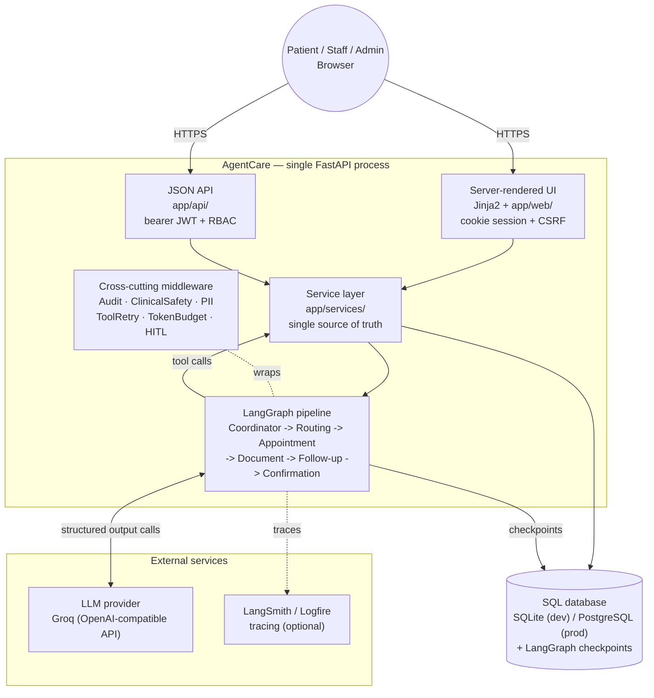

# Architecture

AgentCare is **one FastAPI application** that serves both a server-rendered UI and a
JSON API, backed by a fixed LangGraph agent pipeline and a SQL database. There is no
separate frontend service, no message queue, and no microservices — a deliberate
choice for a system whose correctness and auditability matter more than its ability
to scale out, at least at this stage.

## System diagram

## How a request actually flows

1. A patient submits free text through the UI (or a client posts to the JSON API — both paths converge on step 2).
2. The route handler calls `app/services/workflow_service.create_run`, then hands off to `app/agents/runner.start_workflow`, which executes the LangGraph `StateGraph`.
3. Each graph node (Coordinator, Routing, Appointment, Document, Follow-up, Safety) is a real LangChain agent with its own prompt, tools, and structured-output contract. Every tool call is a thin wrapper over the **same service functions** the REST/UI routes call directly — there is exactly one code path for "book an appointment," whether a human or an agent triggered it.
4. Middleware wraps every agent uniformly: audit logging, deterministic + semantic safety scanning, PII redaction, tool retries, a token budget, and human-in-the-loop approval gates. None of this is something an individual agent can forget, because it isn't the agent's responsibility — it's the harness's.
5. The graph calls out to the configured LLM provider (Groq, OpenAI-compatible) only where natural-language judgement is genuinely needed; routing and classification hit deterministic keyword tables first.
6. Progress and final state persist to the SQL database on every step boundary, alongside an append-only audit trail and the LangGraph checkpoint (which is what makes a suspended human-approval pause survive a process restart).
7. The confirmation message shown to the patient is assembled **from persisted database rows**, never from agent prose — so it cannot claim a booking exists if the row doesn't.

## Why one service layer, two callers

`app/web/` (the UI) and `app/api/` (the JSON API) are both thin controllers over
`app/services/`. Neither contains business logic. This means:

- A booking made by a staff member through the UI and one made by the Appointment agent traverse identical validation, conflict-checking, and audit logic.
- The JSON API can stay mounted indefinitely for a future non-UI client (mobile app, integration partner) without duplicating a single rule.
- Auth differs only in transport: the UI reads a JWT from an HttpOnly cookie, the API reads it from an `Authorization` header. Both resolve to the same `CurrentUser` / role-check functions.

## Data model (summary)

| Table | Purpose |
|---|---|
| `users` · `patient_profiles` | Identity and roles (patient / staff / admin) |
| `departments` · `doctors` · `appointment_slots` | Hospital structure and availability |
| `appointments` | Bookings, with status history |
| `patient_documents` | Metadata, checksum, duplicate links, classification confidence, on-demand summary |
| `workflow_runs` | Current step, status, a human-readable state snapshot |
| `workflow_run_documents` | Which documents were attached to a given request |
| `escalations` | Human-review records, with reviewer and decision |
| `reminders` · `notifications` | Scheduled reminders and dispatch records |
| `audit_events` | Append-only trail of every action, human or agent |

See the main [README](../README.md) for setup, environment variables, and the full
feature list.
